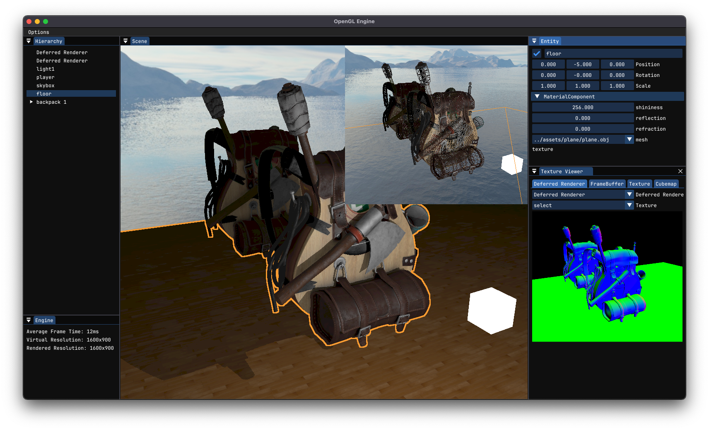

# OpenGL realtime renderer

<p align="center">
  This is a learning project.
</p>

<p align="center">
  <a href="screenshots/">See more screenshots</a>
</p>



## TODO

- SSAO
- Create a CMakeLists.txt for each local dependency (glad, stb, ...) so we can easily configure their compilation properties (ignore warnings, etc)
- Displacement (parallax?) mapping
- Generize Lights and Shadows
- Ability to better sort deferred renderers execution
- auto unbind through RAII
- Move shaders to the post-process shader? (outline shader, and more)
- Antialiasing
- Gizmos (like unreal engine)

## Development Environment

As of 2023 March, we use the following tools.

Either `Visual Studio Code`:

- `C/C++` from `Microsoft`
  - Used only for debugging.
- `CMake Tools` from `Microsoft`
- `clangd` from `LLVM`
  - Accept to disable Intellisense
  - Run `clangd: download language server` to have a proper clangd
- `Clang-Format`

Or you can use `CLion`. Everything works out of the box with CLion.

## Build

We package every dependency as git-submodules. Therefore, after a clone you must run:

`git submodule update --init --recursive`

### MacOS

Once `Xcode` and Xcode developer tools are installed, compilation should work as-is with the provided clang.

Last tested using `Xcode 14.3`

The engine is mainly developed on MacOS. Therefore, best support is on MacOS.

### Windows

Compiles out-of-the-box using `Visual Studio 2022 17.3.4` toolchain.

Does not compile using `MinGW`.

There are OpenGL errors when exiting the application I didn't investigated yet. But the entire engine still works.

### Linux

Last tested on `GCC 12.2.0`.

We need `X11` or `Wayland` development packages installed to compile `libGLFW`. To that end:

```bash
# If you are compiling for X11
sudo apt install xorg-dev # Debian/Ubuntu and derivatives
sudo dnf install libXcursor-devel libXi-devel libXinerama-devel libXrandr-devel # Fedora and derivatives
pkg install xorgproto # FreeBSD

# If you are compiling for Wayland
sudo apt install libwayland-dev libxkbcommon-dev wayland-protocols extra-cmake-modules # Debian/Ubuntu and derivatives
sudo dnf install wayland-devel libxkbcommon-devel wayland-protocols-devel extra-cmake-modules # Fedora and derivatives
pkg install wayland libxkbcommon wayland-protocols kf5-extra-cmake-modules # FreeBSD
```
